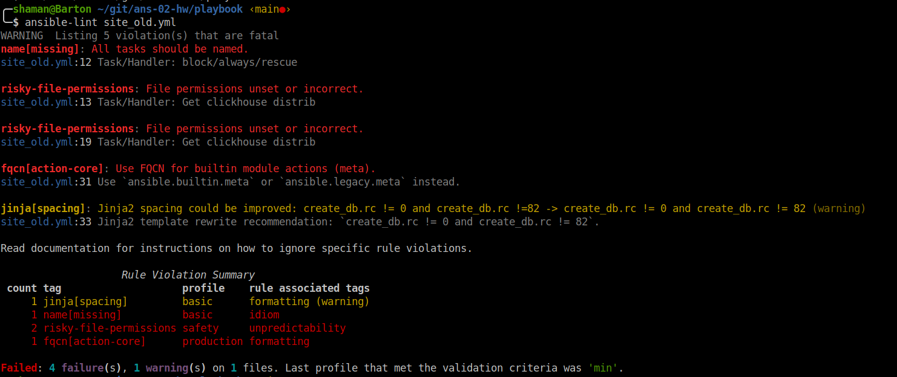
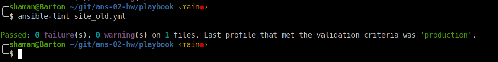
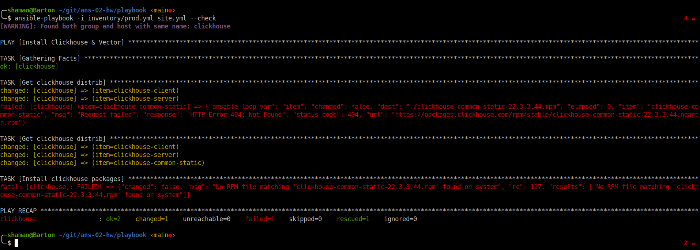
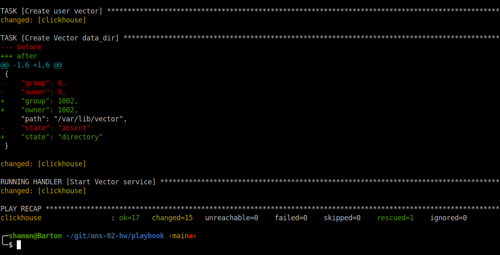
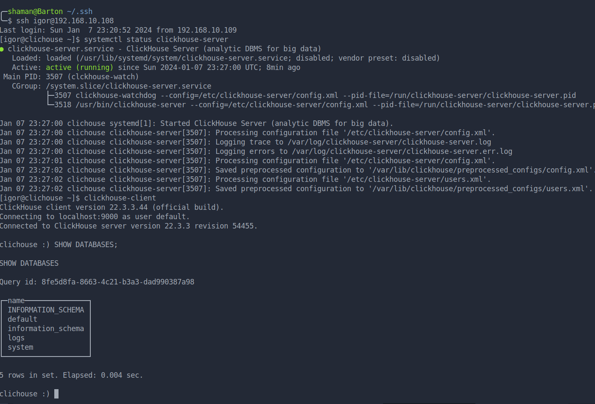

# Домашнее задание к занятию "`Работа с Playbook`" - `Живарев Игорь`

## Подготовка к выполнению

1. * Необязательно. Изучите, что такое [ClickHouse](https://www.youtube.com/watch?v=fjTNS2zkeBs) и [Vector](https://www.youtube.com/watch?v=CgEhyffisLY).
2. Создайте свой публичный репозиторий на GitHub с произвольным именем или используйте старый.
3. Скачайте [Playbook](./playbook/) из репозитория с домашним заданием и перенесите его в свой репозиторий.
4. Подготовьте хосты в соответствии с группами из предподготовленного playbook.

## Основная часть

1. Подготовьте свой inventory-файл `prod.yml`.
2. Допишите playbook: нужно сделать ещё один play, который устанавливает и настраивает [vector](https://vector.dev). Конфигурация vector должна деплоиться через template файл jinja2. От вас не требуется использовать все возможности шаблонизатора, просто вставьте стандартный конфиг в template файл. Информация по шаблонам по [ссылке](https://www.dmosk.ru/instruktions.php?object=ansible-nginx-install).
3. При создании tasks рекомендую использовать модули: `get_url`, `template`, `unarchive`, `file`.
4. Tasks должны: скачать дистрибутив нужной версии, выполнить распаковку в выбранную директорию, установить vector.
5. Запустите `ansible-lint site.yml` и исправьте ошибки, если они есть.
6. Попробуйте запустить playbook на этом окружении с флагом `--check`.
7. Запустите playbook на `prod.yml` окружении с флагом `--diff`. Убедитесь, что изменения на системе произведены.
8. Повторно запустите playbook с флагом `--diff` и убедитесь, что playbook идемпотентен.
9. Подготовьте README.md-файл по своему playbook. В нём должно быть описано: что делает playbook, какие у него есть параметры и теги. Пример качественной документации ansible playbook по [ссылке](https://github.com/opensearch-project/ansible-playbook).
10. Готовый playbook выложите в свой репозиторий, поставьте тег `08-ansible-02-playbook` на фиксирующий коммит, в ответ предоставьте ссылку на него.

---

## Ответ

5. Запуск `ansible-lint site.yml`:



Запуск `ansible-lint site.yml` после исправления ошибок:




6. Запуск playbook с флагом `--check`:

`При необходимости прикрепитe сюда скриншоты
`


7. Запуск playbook с флагом `--diff`:




```
╭─shaman@Barton ~/git/ans-02-hw/playbook ‹main●› 
╰─$ ansible-playbook -i inventory/prod.yml site.yml --check                                                                                                                                4 ↵
[WARNING]: Found both group and host with same name: clickhouse

PLAY [Install Clickhouse & Vector] ************************************************************************************************************************************************************

TASK [Gathering Facts] ************************************************************************************************************************************************************************
ok: [clickhouse]

TASK [Get clickhouse distrib] *****************************************************************************************************************************************************************
changed: [clickhouse] => (item=clickhouse-client)
changed: [clickhouse] => (item=clickhouse-server)
failed: [clickhouse] (item=clickhouse-common-static) => {"ansible_loop_var": "item", "changed": false, "dest": "./clickhouse-common-static-22.3.3.44.rpm", "elapsed": 0, "item": "clickhouse-common-static", "msg": "Request failed", "response": "HTTP Error 404: Not Found", "status_code": 404, "url": "https://packages.clickhouse.com/rpm/stable/clickhouse-common-static-22.3.3.44.noarch.rpm"}

TASK [Get clickhouse distrib] *****************************************************************************************************************************************************************
changed: [clickhouse] => (item=clickhouse-client)
changed: [clickhouse] => (item=clickhouse-server)
changed: [clickhouse] => (item=clickhouse-common-static)

TASK [Install clickhouse packages] ************************************************************************************************************************************************************
fatal: [clickhouse]: FAILED! => {"changed": false, "msg": "No RPM file matching 'clickhouse-common-static-22.3.3.44.rpm' found on system", "rc": 127, "results": ["No RPM file matching 'clickhouse-common-static-22.3.3.44.rpm' found on system"]}

PLAY RECAP ************************************************************************************************************************************************************************************
clickhouse                 : ok=2    changed=1    unreachable=0    failed=1    skipped=0    rescued=1    ignored=0   

╭─shaman@Barton ~/git/ans-02-hw/playbook ‹main●› 
╰─$ ansible-playbook -i inventory/prod.yml site.yml --diff                                                                                                                                 2 ↵
[WARNING]: Found both group and host with same name: clickhouse

PLAY [Install Clickhouse & Vector] ************************************************************************************************************************************************************

TASK [Gathering Facts] ************************************************************************************************************************************************************************
ok: [clickhouse]

TASK [Get clickhouse distrib] *****************************************************************************************************************************************************************
changed: [clickhouse] => (item=clickhouse-client)
changed: [clickhouse] => (item=clickhouse-server)
failed: [clickhouse] (item=clickhouse-common-static) => {"ansible_loop_var": "item", "changed": false, "dest": "./clickhouse-common-static-22.3.3.44.rpm", "elapsed": 0, "item": "clickhouse-common-static", "msg": "Request failed", "response": "HTTP Error 404: Not Found", "status_code": 404, "url": "https://packages.clickhouse.com/rpm/stable/clickhouse-common-static-22.3.3.44.noarch.rpm"}

TASK [Get clickhouse distrib] *****************************************************************************************************************************************************************
changed: [clickhouse] => (item=clickhouse-client)
ok: [clickhouse] => (item=clickhouse-server)
ok: [clickhouse] => (item=clickhouse-common-static)

TASK [Install clickhouse packages] ************************************************************************************************************************************************************
changed: [clickhouse]

TASK [Flush handlers] *************************************************************************************************************************************************************************

RUNNING HANDLER [Start clickhouse service] ****************************************************************************************************************************************************
changed: [clickhouse]

TASK [Wait for clickhouse-server to become available] *****************************************************************************************************************************************
Pausing for 15 seconds (output is hidden)
(ctrl+C then 'C' = continue early, ctrl+C then 'A' = abort)
ok: [clickhouse]

TASK [Create database] ************************************************************************************************************************************************************************
changed: [clickhouse]

TASK [Create vector work directory] ***********************************************************************************************************************************************************
--- before
+++ after
@@ -1,5 +1,5 @@
 {
-    "mode": "0775",
+    "mode": "0755",
     "path": "/home/igor/vector",
-    "state": "absent"
+    "state": "directory"
 }

changed: [clickhouse]

TASK [Get Vector distrib] *********************************************************************************************************************************************************************
changed: [clickhouse]

TASK [Unzip Vector archive] *******************************************************************************************************************************************************************
changed: [clickhouse]

TASK [Install Vector binary] ******************************************************************************************************************************************************************
changed: [clickhouse]

TASK [Check Vector installation] **************************************************************************************************************************************************************
changed: [clickhouse]

TASK [Create Vector config vector.toml] *******************************************************************************************************************************************************
changed: [clickhouse]

TASK [Create vector.service daemon] ***********************************************************************************************************************************************************
changed: [clickhouse]

TASK [Modify vector.service file] *************************************************************************************************************************************************************
--- before: /lib/systemd/system/vector.service
+++ after: /lib/systemd/system/vector.service
@@ -8,7 +8,7 @@
 User=vector
 Group=vector
 ExecStartPre=/usr/bin/vector validate
-ExecStart=/usr/bin/vector
+ExecStart=/usr/bin/vector --config /etc/vector/vector.toml
 ExecReload=/usr/bin/vector validate
 ExecReload=/bin/kill -HUP $MAINPID
 Restart=no

changed: [clickhouse]

TASK [Create user vector] *********************************************************************************************************************************************************************
changed: [clickhouse]

TASK [Create Vector data_dir] *****************************************************************************************************************************************************************
--- before
+++ after
@@ -1,6 +1,6 @@
 {
-    "group": 0,
-    "owner": 0,
+    "group": 1002,
+    "owner": 1002,
     "path": "/var/lib/vector",
-    "state": "absent"
+    "state": "directory"
 }

changed: [clickhouse]

RUNNING HANDLER [Start Vector service] ********************************************************************************************************************************************************
changed: [clickhouse]

PLAY RECAP ************************************************************************************************************************************************************************************
clickhouse                 : ok=17   changed=15   unreachable=0    failed=0    skipped=0    rescued=1    ignored=0   

```

Проверка внесения изменений:



```
╭─shaman@Barton ~/.ssh 
╰─$ ssh igor@192.168.10.108        
Last login: Sun Jan  7 23:20:52 2024 from 192.168.10.109
[igor@clichouse ~]$ systemctl status clickhouse-server
● clickhouse-server.service - ClickHouse Server (analytic DBMS for big data)
   Loaded: loaded (/usr/lib/systemd/system/clickhouse-server.service; disabled; vendor preset: disabled)
   Active: active (running) since Sun 2024-01-07 23:27:00 UTC; 8min ago
 Main PID: 3507 (clckhouse-watch)
   CGroup: /system.slice/clickhouse-server.service
           ├─3507 clickhouse-watchdog --config=/etc/clickhouse-server/config.xml --pid-file=/run/clickhouse-server/clickhouse-server.pid
           └─3518 /usr/bin/clickhouse-server --config=/etc/clickhouse-server/config.xml --pid-file=/run/clickhouse-server/clickhouse-server.pid

Jan 07 23:27:00 clichouse systemd[1]: Started ClickHouse Server (analytic DBMS for big data).
Jan 07 23:27:00 clichouse clickhouse-server[3507]: Processing configuration file '/etc/clickhouse-server/config.xml'.
Jan 07 23:27:00 clichouse clickhouse-server[3507]: Logging trace to /var/log/clickhouse-server/clickhouse-server.log
Jan 07 23:27:00 clichouse clickhouse-server[3507]: Logging errors to /var/log/clickhouse-server/clickhouse-server.err.log
Jan 07 23:27:01 clichouse clickhouse-server[3507]: Processing configuration file '/etc/clickhouse-server/config.xml'.
Jan 07 23:27:02 clichouse clickhouse-server[3507]: Saved preprocessed configuration to '/var/lib/clickhouse/preprocessed_configs/config.xml'.
Jan 07 23:27:02 clichouse clickhouse-server[3507]: Processing configuration file '/etc/clickhouse-server/users.xml'.
Jan 07 23:27:02 clichouse clickhouse-server[3507]: Saved preprocessed configuration to '/var/lib/clickhouse/preprocessed_configs/users.xml'.
[igor@clichouse ~]$ clickhouse-client
ClickHouse client version 22.3.3.44 (official build).
Connecting to localhost:9000 as user default.
Connected to ClickHouse server version 22.3.3 revision 54455.

clichouse :) SHOW DATABASES;

SHOW DATABASES

Query id: 8fe5d8fa-8663-4c21-b3a3-dad990387a98

┌─name───────────────┐
│ INFORMATION_SCHEMA │
│ default            │
│ information_schema │
│ logs               │
│ system             │
└────────────────────┘

5 rows in set. Elapsed: 0.004 sec. 

clichouse :) 

```

8. Проверка идемпотентности playbook:

```

╭─shaman@Barton ~/git/ans-02-hw/playbook ‹main●› 
╰─$ ansible-playbook -i inventory/prod.yml site.yml --diff
[WARNING]: Found both group and host with same name: clickhouse

PLAY [Install Clickhouse & Vector] ************************************************************************************************************************************************************

TASK [Gathering Facts] ************************************************************************************************************************************************************************
ok: [clickhouse]

TASK [Get clickhouse distrib] *****************************************************************************************************************************************************************
ok: [clickhouse] => (item=clickhouse-client)
ok: [clickhouse] => (item=clickhouse-server)
failed: [clickhouse] (item=clickhouse-common-static) => {"ansible_loop_var": "item", "changed": false, "dest": "./clickhouse-common-static-22.3.3.44.rpm", "elapsed": 0, "gid": 1001, "group": "igor", "item": "clickhouse-common-static", "mode": "0644", "msg": "Request failed", "owner": "igor", "response": "HTTP Error 404: Not Found", "secontext": "unconfined_u:object_r:user_home_t:s0", "size": 246310036, "state": "file", "status_code": 404, "uid": 1001, "url": "https://packages.clickhouse.com/rpm/stable/clickhouse-common-static-22.3.3.44.noarch.rpm"}

TASK [Get clickhouse distrib] *****************************************************************************************************************************************************************
ok: [clickhouse] => (item=clickhouse-client)
ok: [clickhouse] => (item=clickhouse-server)
ok: [clickhouse] => (item=clickhouse-common-static)

TASK [Install clickhouse packages] ************************************************************************************************************************************************************
ok: [clickhouse]

TASK [Flush handlers] *************************************************************************************************************************************************************************

TASK [Wait for clickhouse-server to become available] *****************************************************************************************************************************************
Pausing for 15 seconds (output is hidden)
(ctrl+C then 'C' = continue early, ctrl+C then 'A' = abort)
ok: [clickhouse]

TASK [Create database] ************************************************************************************************************************************************************************
ok: [clickhouse]

TASK [Create vector work directory] ***********************************************************************************************************************************************************
ok: [clickhouse]

TASK [Get Vector distrib] *********************************************************************************************************************************************************************
ok: [clickhouse]

TASK [Unzip Vector archive] *******************************************************************************************************************************************************************
ok: [clickhouse]

TASK [Install Vector binary] ******************************************************************************************************************************************************************
ok: [clickhouse]

TASK [Check Vector installation] **************************************************************************************************************************************************************
changed: [clickhouse]

TASK [Create Vector config vector.toml] *******************************************************************************************************************************************************
ok: [clickhouse]

TASK [Create vector.service daemon] ***********************************************************************************************************************************************************
changed: [clickhouse]

TASK [Modify vector.service file] *************************************************************************************************************************************************************
--- before: /lib/systemd/system/vector.service
+++ after: /lib/systemd/system/vector.service
@@ -8,7 +8,7 @@
 User=vector
 Group=vector
 ExecStartPre=/usr/bin/vector validate
-ExecStart=/usr/bin/vector
+ExecStart=/usr/bin/vector --config /etc/vector/vector.toml
 ExecReload=/usr/bin/vector validate
 ExecReload=/bin/kill -HUP $MAINPID
 Restart=no

changed: [clickhouse]

TASK [Create user vector] *********************************************************************************************************************************************************************
ok: [clickhouse]

TASK [Create Vector data_dir] *****************************************************************************************************************************************************************
ok: [clickhouse]

RUNNING HANDLER [Start Vector service] ********************************************************************************************************************************************************
changed: [clickhouse]

PLAY RECAP ************************************************************************************************************************************************************************************
clickhouse                 : ok=16   changed=4    unreachable=0    failed=0    skipped=0    rescued=1    ignored=0   

```

9. Playbook скачивает и устанавливает СУБД ClickHouse и конвеер данных Vector.
Тэги `clickhouse` и `vector` делят playbook на две логические части, скачивания и установки соответсвующих тэгам продуктов.


---
